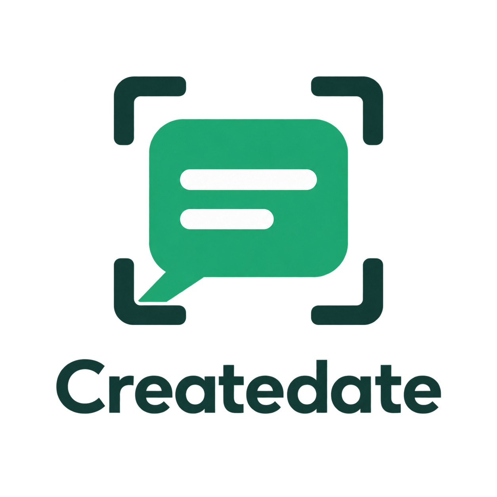
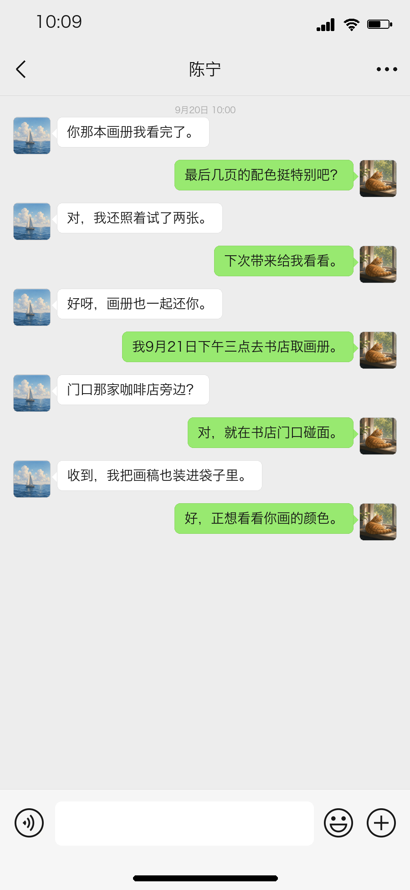
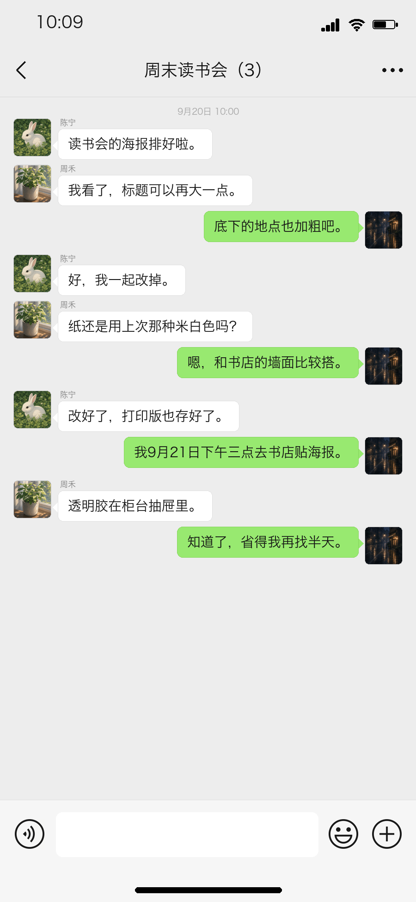

<h1 align="center">
  
</h1>

<p align="center">
  <strong>微信风格合成数据工具 · 对话、截图与日程标签，一套流程生成。</strong>
</p>

<p align="center">
  Synthetic Chinese chats, WeChat-style screenshots, and paired schedule labels for multimodal fine-tuning.
</p>

<p align="center">
  <a href="pyproject.toml"></a>
  <a href="LICENSE"></a>
</p>

<p align="center">
  <a href="#效果展示">效果展示</a> ·
  <a href="#快速开始">快速开始</a> ·
  <a href="#生成自己的数据">生成数据</a> ·
  <a href="docs/architecture.md">技术设计</a> ·
  <a href="docs/usage.md">使用指南</a> ·
  <a href="#许可">MIT 许可</a>
</p>

Createdate 面向中文聊天截图的**日程抽取与多模态微调**。
它通过模型生成私聊或群聊，校验约定，再将对话渲染为截图，导出配套的 LLaMA-Factory 训练数据。
仓库包含完整工具和两段虚构演示，不分发作者的工作数据或训练数据集。

## 效果展示

<div align="center">
  <table align="center">
    <tr>
      <th align="center">私聊 · 归还画册</th>
      <th align="center">群聊 · 准备读书会海报</th>
    </tr>
    <tr>
      <td align="center"></td>
      <td align="center"></td>
    </tr>
  </table>
  <p>以上截图由本项目渲染器生成，内容为 <strong>AI 辅助编写的虚构对话</strong>。</p>
</div>

左侧私聊截图对应的日程标签如下，导出时作为模型的目标回答：

```json
{
  "items": [
    {
      "title": "去书店取画册",
      "date": "2026-09-21",
      "time": "15:00",
      "note": ""
    }
  ]
}
```

## 功能亮点

- **对话与标签配套**：约定的动作、日期与时间需在绿色气泡中明确出现，并与源数据的 `schedule` 对应。
- **私聊与群聊生成**：独立的场景规划、成稿和审校流程；每段新生成对话包含 10–12 条短消息。
- **本地批量渲染**：默认 `900 × 1949` 单屏 PNG，支持中文字体、宽度和自身身份设置。
- **训练格式导出**：配对截图与标签，生成 ShareGPT 格式的训练/验证 JSON 和 `dataset_info.json`。
- **无需密钥即可体验**：自带示例的截图渲染与 `schedule` 模式导出均在本地完成。
- **模型服务可选**：默认 DeepSeek，也支持 CLIProxyAPI 和自定义兼容接口，可配置自己的密钥、接口地址与模型。

**场景规划 → 对话 JSON 与日程 → 截图 PNG → LLaMA-Factory 训练格式**

## 技术亮点

- **Prompt Chaining**：将生成拆成场景蓝图、消息节拍、对话成稿、对照审校四个阶段，逐步传递人物与约定。
- **约束与反馈修复**：结合 JSON 结构、人物身份、未来日程和绿色气泡信息检查，将校验错误反馈给模型修复。
- **多样性控制**：结合近期话题、关键词领域分类和结尾去重，减少批量生成中的重复场景。
- **图文数据配对**：从同一份会话 JSON 渲染截图、提取日程标签，导出 ShareGPT 多模态样本；支持逐条保存与断点续跑。

流程图、实现细节与适用边界见 **[技术设计](docs/architecture.md)**。

## 快速开始

需要 **Python 3.11+**、[uv](https://docs.astral.sh/uv/getting-started/installation/)
和本地中文字体。下载或克隆仓库后，在项目根目录执行：

```bash
# 安装锁定版本的依赖
uv sync --locked

# 将自带私聊示例渲染为截图
uv run python scripts/render_private_chat.py examples/private_demo.json -o output/demo/private

# 将截图与日程标签导出为 LLaMA-Factory 格式
uv run python scripts/export_llamafactory_dataset.py \
  --source examples/private_demo.json \
  --images output/demo/private \
  --output output/demo/llamafactory \
  --label-mode schedule
```

完成后可查看：

| 路径 | 内容 |
| --- | --- |
| `output/demo/private/private_demo.png` | 私聊截图 |
| `output/demo/llamafactory/images/` | 导出数据包中的配套图片 |
| `output/demo/llamafactory/*_train.json`、`*_eval.json` | 训练与验证样本 |
| `output/demo/llamafactory/dataset_info.json` | LLaMA-Factory 字段映射与数据集注册信息 |

**不需要 API Key 或模型服务。** 首次安装依赖需要联网。
演示只有一条样本，按当前划分逻辑进入验证集，训练集为空；它用于检查流程，正式训练需要自行生成足够的数据。

<details>
<summary>体验群聊截图</summary>

```bash
uv run python scripts/render_group_chat.py examples/group_demo.json -o output/demo/group
```

图片保存为 `output/demo/group/group_demo.png`。群聊数据导出使用
`scripts/export_group_llamafactory_dataset.py`，参数可通过 `--help` 查看。

</details>

<details>
<summary>找不到中文字体时如何处理</summary>

通过 `--font` 指定已安装的中文 `.ttf` 或 `.ttc` 字体；将下方示例路径替换为实际路径：

```bash
uv run python scripts/render_private_chat.py examples/private_demo.json \
  --font /path/to/chinese-font.ttf -o output/demo/private
```

字体不随项目分发，不同系统和字体的文字排版可能略有差异。

</details>

## 生成自己的数据

首次使用时，将 [.env.example](.env.example) 复制为项目根目录的 `.env`，填写所选服务的密钥和模型配置：

```bash
cp -n .env.example .env
```

程序自动读取 `.env`。默认使用 DeepSeek；修改 `LLM_PROVIDER` 可选择 `cliproxy` 或 `custom`，
后续运行无需重复配置。填写方式见[密钥配置](docs/usage.md#api-key-配置)。

```bash
# 先生成一条私聊，确认模型服务和输出效果
uv run python scripts/generate_private_dataset.py \
  -n 1 \
  --direction "朋友之间的日常协作" \
  -o data/private_generated.json

# 渲染刚刚生成的对话
uv run python scripts/render_private_chat.py data/private_generated.json -o output/generated/private
```

将 `-n 1` 改为所需数量即可批量生成。随后使用上面的导出命令，
将 `--source` 和 `--images` 分别换成新生成的 JSON 与截图目录。
群聊对应 `generate_group_dataset.py` 和 `render_group_chat.py`。

| 操作 | 是否调用模型 |
| --- | --- |
| 渲染已有 JSON、`schedule` 模式导出 | 否 |
| 生成新对话 | 是，使用所选提供商 |
| `teacher` 模式导出 | 是，将源对话发送给所选模型服务生成标注，默认 DeepSeek |

生成一段对话包含多次请求，校验失败还会重试，可能产生 API 费用。
也可使用 `--provider cliproxy` 连接自行配置的 CLIProxyAPI；本机代理仍可能转发请求到外部模型服务。
使用其他服务商时，在 `.env` 中设置 `LLM_PROVIDER=custom`，并填写 `LLM_API_KEY`、`LLM_BASE_URL` 和 `LLM_MODEL`。
接口需兼容 Chat Completions 和 JSON 对象输出，配置示例见[自定义模型服务](docs/usage.md#自定义模型服务)。
模型选择和命令参数见[使用指南](docs/usage.md)，提示链与质量控制原理见[技术设计](docs/architecture.md)。

## 数据与使用范围

- **抽取目标**：默认以 `participants[0]` 为右侧绿色气泡发送者，新生成数据要求此人明确参与一项未来约定。“未来”相对于对话时间。
- **任务范围**：当前生成流程集中于单项明确日程；无日程、多日程、模糊时间等场景需要额外构建。
- **格式与效果**：导出使用 LLaMA-Factory 的 ShareGPT 多模态格式；格式兼容不代表已经验证训练效果，项目尚无真实场景效果基准。
- **本地数据**：`data/`、`output/`、`archive/`、`llamafactory_*/` 和 `work/` 已在 `.gitignore` 中排除，不随源码发布。
- **合成说明**：程序不采集微信账户或聊天记录。截图目前不会自动添加合成水印，对外展示时请保留显著的虚构说明。

合成内容和标签仍需人工审核。用于训练或评估时，应补充负样本、多样化场景和独立测试集。
模型训练需要在 LLaMA-Factory 中另行配置，本项目负责数据准备。

## 文档与项目结构

| 入口 | 内容 |
| --- | --- |
| [使用指南](docs/usage.md) | 模型配置、完整 JSON 格式与命令 |
| [技术设计](docs/architecture.md) | Prompt Chaining、约束校验、反馈修复与图文数据配对 |
| [脚本](scripts/) | 对话生成、截图渲染、标注与数据导出 |
| [示例](examples/) | 可直接运行的私聊与群聊 JSON |
| [测试](tests/) | 本地自动化测试 |

## 贡献

欢迎提交 Issue 或 Pull Request，改进日程边界案例、排版效果、数据质量检查，
或补充可复现的训练与评估示例。反馈问题时请附上系统、Python 版本、运行命令和最小虚构 JSON。

本地测试无需模型 API Key：

```bash
uv run pytest -q
```

<details>
<summary>相关截图工具</summary>

- [wechat-dialog-generator](https://github.com/gaopengbin/wechat-dialog-generator)：可视化编辑、多种消息类型与批量截图。
- [cn-chat-style-gen](https://github.com/webkubor/cn-chat-style-gen)：对话、拉人、列表和朋友圈模式，语料管理与批量导出。
- [wechatscreenshotgenerator](https://github.com/baifengbai/wechatscreenshotgenerator)：Python/Tkinter 桌面截图编辑器。

本项目专注于日程抽取所需的对话、截图与结构化标签的配套生成。

</details>

## 许可

代码、文档及 `examples/` 中的虚构演示采用 [MIT 许可证](LICENSE)，使用与分发时请保留版权及许可声明。

独立开发项目，与腾讯或微信无隶属、授权或背书关系。
第三方依赖与模型服务适用各自的许可或服务条款。
