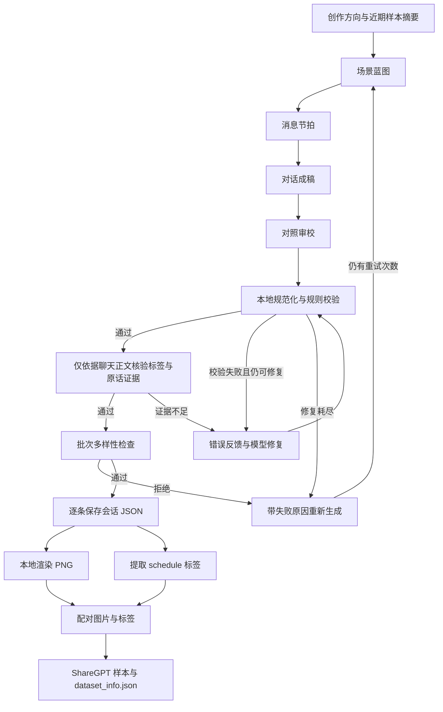

# 技术设计

[返回项目首页](../README.md) · [使用指南](usage.md)

Createdate 将场景创作、数据校验、截图渲染与标签导出连接成一套面向日程抽取的数据准备流程。
核心设计是：先确定人物和约定，再逐步生成对话；通过本地规则检查结果，并让模型根据具体错误修复。

本文介绍当前代码已经实现的机制。安装与运行命令见[使用指南](usage.md)。

## 流程概览

[`run_pipeline.py`](../scripts/run_pipeline.py) 按顺序调用生成、渲染与导出能力，也保留各阶段的独立命令。统一入口先检查字体和素材，阶段失败时停止后续处理，重跑时复用已保存的会话。保存的会话 JSON 是后续处理的共同输入，可以修改渲染参数后重新出图，或单独重新导出标签。

## Prompt Chaining：分阶段生成

私聊和群聊各自使用四阶段提示链。每个阶段有独立的系统提示词、输入上下文和 JSON 输出要求，前序结果会传入后续请求。

| 阶段 | 主要输出 | 解决的问题 |
| --- | --- | --- |
| 场景蓝图（Brief） | 人物、关系、事件、细节、`confirmed_schedule` | 在写台词前确定聊天动机和最终约定 |
| 消息节拍（Beat Plan） | 每条消息的说话人、目的、关键细节和情绪 | 安排信息出现顺序与人物互动 |
| 对话成稿（Draft） | 含 `messages` 和 `schedule` 的完整会话 | 将节拍展开为适合截图的中文短消息 |
| 对照审校（Review） | 对照蓝图与节拍修订后的会话 | 检查事实漂移、旧安排残留和生硬表达 |

例如，“朋友约定去书店取画册”先在蓝图中确定负责人、日期和时间；节拍阶段再安排谁先提起、谁确认时间；成稿与审校阶段将这些信息写入自然对话。

模型审校与生成使用同一个客户端，区别在于提示词和阶段职责。四阶段创作完成后，还会增加一次只依据聊天正文的标签证据核验。因此一次顺利完成的新样本生成需要五次模型调用；修复后重新核验以及整条重新生成会增加请求数量。

实现入口：[私聊提示链](../scripts/generate_private_dataset.py)中的 `generate_private_one`，以及[群聊提示链](../scripts/generate_group_dataset.py)中的 `generate_group_one`。

## 结构化约束：稳定人物与抽取目标

提示链通过中间 JSON 传递约束：蓝图确定人物名单和 `confirmed_schedule`，节拍确定发言顺序；后续提示词要求沿用这些信息。
本地代码同时检查名单和节拍，并在最终校验前按计划约束人物字段。

| 检查层次 | 当前生成入口中的规则 |
| --- | --- |
| JSON 结构 | 必需字段、字段类型、消息字段与日程字段；部分嵌套字段还要求固定顺序 |
| 人物与消息 | 私聊 2 人，群聊 3–5 人；消息共 10–12 条；说话人属于参与者名单 |
| 时间关系 | 消息时间不倒退；唯一日程晚于聊天结束时间 |
| 抽取对象 | 日程属于 `participants[0]`，即默认右侧绿色气泡发送者 |
| 可读信息 | 在绿色消息中匹配最终日期、具体钟点与任务文字线索 |

模型请求使用 `response_format={"type":"json_object"}`，返回结果仍需经过本地解析和手写校验。
字段顺序等要求属于项目自身约定。基础会话格式允许 0–3 项日程，当前私聊和群聊生成入口还会执行更严格的单项未来日程检查。

这一设计让生成目标与训练任务保持对应：截图中应出现可抽取的信息，源 JSON 中保留结构化标签。
目前任务检查使用文字片段匹配，日期和钟点也依赖字符串规则；它们无法证明完整语义一致。
蓝图中的 `confirmed_schedule` 与最终 `schedule` 的逐字段一致性主要由提示词要求，尚无专门的本地等值断言。

实现入口：[公共生成模块](../scripts/dataset_generation.py)中的 `validate_conversation`、`private_plan_contract`、`group_plan_contract`、`validate_private_training_schedule` 与 `validate_group_training_schedule`。

## 标签证据核验：隔离创作背景

生成模型能看到场景蓝图和人物身份，但下游模型只能看到截图。例如，蓝图里有“房屋出租”，
正文却只约定“拍房子”，标签就不能扩写成“拍房屋照片用于出租平台”。
成稿与审校提示要求 `task` 使用最小充分描述，允许删去正文不支持的附加细节，保留核心活动和已确认的负责人、日期、时间。

新样本通过本地规则后，会调用 [`schedule_evidence.py`](../scripts/schedule_evidence.py) 再做一次核验：

1. 只发送消息正文、发送者、绿色标记和候选日程，排除蓝图、`topic`、人物身份描述及消息发送时间。
2. 模型检查标题的动作、对象、地点和用途等是否有依据，并分别为任务、日期、时间引用消息原话。
3. 本地检查引用序号和文字确实存在，且每类证据至少包含一条绿色消息。引用不存在、缺失或模型判定不支持时均拒绝。
4. 失败原因进入已有修复循环，优先删除标签中无依据的附加细节；修复后再次核验，达到上限仍失败则拒绝该候选样本。

原先的双字词重合检查仅作为粗筛，不能证明整个标题有依据。新增核验中的语义判断仍由同一模型服务完成，
可能漏判或误判，不能替代人工抽检。旧文件续跑、`--source` 和本地 `schedule` 导出不会自动重新调用模型核验，
已有数据需单独检查；手工修正源 JSON 后应重新渲染并导出，保持截图、标签一致。

## 校验反馈修复：把失败原因带回生成过程

模型审校之后还有本地检查。处理顺序为：

1. **规范化**：统一可识别的日期和钟点格式，清理文本标记，处理超长消息，并按计划约束人物字段。
2. **校验**：检查结构、日历信息、口语规则和日程条件，再核验标签的正文依据。
3. **反馈修复**：将当前会话与具体校验错误一起交给模型，要求修复后返回完整 JSON，再次检查。
4. **重新生成**：修复仍失败或批次检查拒绝时，重新执行提示链，并在创作要求中加入近期失败原因。

例如，当绿色消息只写“到时见”，未出现明确日期时，校验错误会指出缺少日期信息；修复请求携带这条错误，使下一次调用有具体的修改目标。

| 层次 | 默认上限 | 用途 |
| --- | --- | --- |
| 单次模型请求 | 总共 3 次尝试 | 处理部分临时 HTTP 错误、网络错误与响应解析失败 |
| 成稿修复 | 最多 2 次模型修复 | 修复本地校验或标签证据核验发现的问题 |
| 单条样本生成 | 最多 20 次生成尝试 | 处理提示链失败或批次拒绝，并反馈近期失败原因 |

规范化可能修改内容：例如收缩超出月份范围的日期、删去错误星期，或缩短超长消息。查看结果时应检查这些改动是否保留了原意。
上述限制分别作用于不同层次；整条样本的请求数量不能按“三次请求”估算。

实现入口：[公共生成模块](../scripts/dataset_generation.py)中的 `ChatCompletionClient.complete`、`validate_with_repair` 和 `generate_dataset`。

## 多样性控制：利用近期样本约束下一条

批量生成时，程序会将近期样本的信息加入提示词，并在结果返回后执行本地检查。

| 机制 | 当前实现 |
| --- | --- |
| 话题避重 | 向模型提供最近 8 条话题；检查归一化后的相同话题，以及达到长度条件的话题字符串相似度 |
| 领域避重 | 用 14 类关键词规则分类，拒绝与最近 2 条样本领域重合的结果；蓝图阶段也会提前检查 |
| 群名检查 | 提示词提供最近 24 个群名；结果检查覆盖当前输出文件内全部已有群名 |
| 结尾检查 | 检查当前输出文件内重复的结尾，少量常用简短回应设有豁免 |
| 重试反馈 | 将最近的失败原因加入下一次请求；未指定方向时，重试还可提供宽泛领域提示 |

领域分类优先读取话题与群名，匹配不到时再查看消息正文。
这些机制用于减少局部重复；关键词和字符串相似度仍可能误判，也无法保证各领域的样本数量均衡。

实现入口：[公共生成模块](../scripts/dataset_generation.py)中的 `TOPIC_DOMAIN_PATTERNS`、`conversation_primary_domain_tags`、`reject_forbidden_brief_domains` 和 `generate_dataset`。

## 图文标签配对：从同一份会话导出训练样本

会话 JSON 同时包含 `messages` 和 `schedule`：渲染器读取消息生成截图，导出器读取日程构造目标回答，并通过会话 ID 对应图片文件。

默认 `schedule` 模式在本地完成标签转换：

| 源字段 | 导出用途 |
| --- | --- |
| `conversation_id` | 对应截图文件名 |
| `participants[0]` | 默认绿色气泡身份，也是标签筛选的目标人物 |
| `messages` | 渲染截图中的聊天内容 |
| `schedule.task` | 目标回答中的 `items[].title` |
| `schedule.date` / `schedule.time` | 目标回答中的日期与时间 |

源 `schedule` 没有 `note` 字段，默认导出的 `note` 为空字符串。可选 `teacher` 模式会将源对话文本发送给所选模型服务生成标注，默认使用 DeepSeek；它不读取截图像素。

`schedule` 标签每次导出都重新计算。`teacher` 标签通过[标注缓存模块](../scripts/annotation_cache.py)按请求指纹复用：指纹包含完整源会话、服务商、接口地址、模型、实际系统与用户提示、采样温度和缓存版本，不包含密钥。
每条标签与指纹一起原子写入 `teacher_cache.json`，便于中断后继续；源内容或标注配置变化时自动重新标注。旧的无指纹标注文件不能用来判断缓存是否有效，会重新生成标签。

导出结果包括带 `<image>` 标记的用户提示、JSON 字符串形式的目标回答、`images` 图片路径，以及 `dataset_info.json` 中的 ShareGPT 字段映射。
同一输入顺序与相同 `seed` 下，随机打乱和训练/验证划分可复现；默认种子为 `42`。

训练数据配对时应保留默认绿色方身份。渲染器的 `--self` 可以改变截图右侧人物，而导出器仍按 `participants[0]` 筛选标签，两者需要保持一致。
源数据对应关系也不能替代截图抽查：字体、换行与排版是否完整呈现关键信息，仍需查看实际输出。

实现入口：[渲染命令适配层](../scripts/chat_render_cli.py)、[截图渲染器](../scripts/wechat_screenshot.py)、[私聊导出器](../scripts/export_llamafactory_dataset.py)和[群聊导出器](../scripts/export_group_llamafactory_dataset.py)。

## 模型接口：共用提示链与校验流程

生成器和 `teacher` 导出器通过 `build_generation_client` 创建客户端，支持默认的 DeepSeek、本机 CLIProxyAPI，以及 `custom` 自定义兼容接口。
不同服务使用各自的密钥配置，自定义模式还接收接口地址与模型 ID；切换服务后继续使用同一套提示链、修复逻辑和校验规则。
项目根目录 `.env` 可保存默认服务商与模型配置；命令行参数和终端环境变量优先于文件内容，日常运行无需重复输入配置。

当前传输协议为 Chat Completions 风格的 JSON 请求，使用 Bearer 鉴权与 JSON 对象输出。兼容性取决于目标服务实际支持的参数和响应格式，不能仅凭 API Key 接入任意原生接口。
配置与命令见[自定义模型服务](usage.md#自定义模型服务)。

## 断点续跑：保存已通过检查的样本

每接受一条会话，生成器就将当前结果写入临时文件，再通过 `os.replace` 替换目标 JSON。
再次运行时会读取并检查已有数据，从已完成数量继续生成，因此中途请求失败后可以保留已落盘的结果。

`-n` 表示输出文件的**目标总条数**。例如文件已有 8 条，使用同一路径运行 `-n 10`，会继续补足 2 条。
续跑检查与新样本生成检查的范围存在差异，旧数据不会完整重走提示链和全部训练约束。
保存以完整会话为单位，中间蓝图与草稿没有独立检查点；同一输出文件也没有并发写入锁，应由一个生成进程写入。

实现入口：[公共生成模块](../scripts/dataset_generation.py)中的 `generate_dataset`。

## 当前范围与评估

当前生成策略集中于“绿色方明确参与的一项未来约定”，适合构建这一目标下的合成样本。
无日程、多日程、隐含日期和复杂跨人指代等情况，需要额外设计样本与校验规则。

这些技术提供了可检查、可重试的数据生成流程。项目尚未通过消融实验量化各环节带来的质量提升，也没有真实聊天场景的训练效果基准。
如需评估，可分别记录提示链通过率、修复比例、单条样本成本、人工标签一致率，并在独立测试集上测量下游日程抽取效果。
LLaMA-Factory 格式兼容只说明数据组织方式符合导出目标，训练配置与效果验证仍需另行完成。
